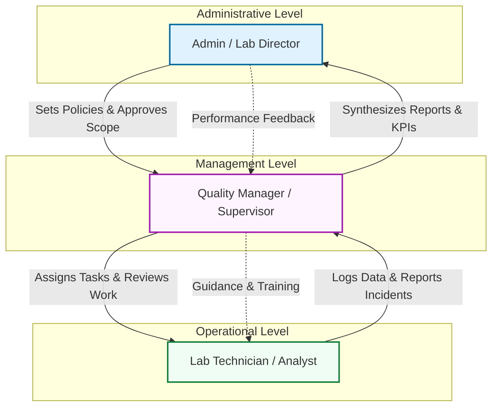

# Theoretical Workflow: QMS Hierarchy

This document outlines the theoretical flow and responsibilities across the three primary roles in the Quality Management System: **Admin**, **Manager**, and **Staff**.

## Role Hierarchy & Data Flow

The following diagram illustrates the simplified flow of information and authority within the system.

---

## 1. Admin (Laboratory Director / System Administrator)
The **Admin** sits at the top of the hierarchy, focusing on high-level strategy, compliance, and final approvals.

- **Primary Responsibilities**:
    - **Policy Setting**: Defines the laboratory's quality policy and ensures it aligns with ISO standards.
    - **Resource Management**: Approves budgets, staffing levels, and major equipment purchases.
    - **Final Approval**: Performs the final sign-off on major Management Review Meeting (MRM) minutes and high-risk CAPAs.
    - **User Administration**: Manages system-wide permissions and onboarding of new departments.

## 2. Manager (Quality Manager / Department Supervisor)
The **Manager** acts as the bridge between administrative goals and daily operations. They are responsible for the "process".

- **Primary Responsibilities**:
    - **Audit & Review**: Coordinates internal audits and monitors Quality Indicators.
    - **CAPA Oversight**: Investigates Non-Conformances reported by staff and defines corrective actions.
    - **Training Management**: Assigns training modules to staff and verifies competency.
    - **Document Control**: Reviews SOP drafts created by staff before they reach the Admin for final approval.

## 3. Staff (Lab Technician / Quality Analyst)
The **Staff** are the primary "data generators" in the system. They perform the day-to-day diagnostic and quality tasks.

- **Primary Responsibilities**:
    - **Data Entry**: Logs daily instrument calibrations, environmental monitoring, and diagnostic results.
    - **Incident Reporting**: Initiates Non-Conformance reports whenever a deviation is detected.
    - **Compliance**: Follows established SOPs and completes assigned training tasks.
    - **Evidence Gathering**: Provides the raw data and evidence needed for Management Reviews.

---

## The Workflow Loop
1. **Initiation**: **Staff** detects an issue (e.g., failed calibration) and logs it.
2. **Review**: **Manager** reviews the incident, performs a root cause analysis, and assigns a CAPA.
3. **Synthesis**: **Manager** aggregates multiple incidents into a monthly report for the **Admin**.
4. **Decision**: **Admin** reviews the report during an MRM and decides on strategic changes or resource allocations.
